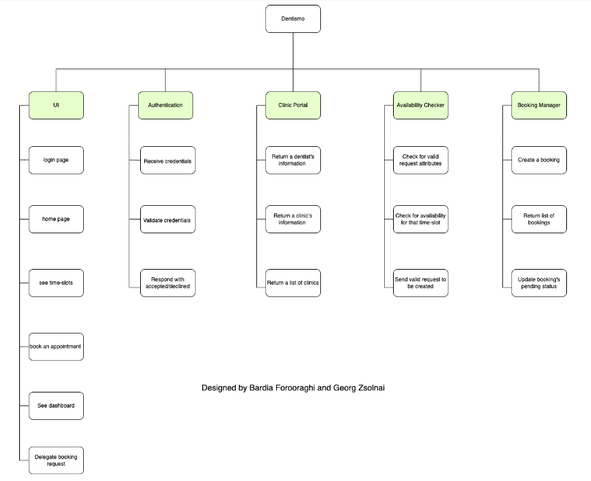

# Documentation

## Purpose:

### Team members Roles, and Tasks:
- Georg Zsolnai (guszsoge@student.gu.se): Product Owner
- Ansis Plepis (gusplean@student.gu.se): Frontend Scrum Master
- Bardia Forooraghi (gusforoba@student.gu.se): Backend Scrum Master
- Ivan Vidackovic (gusvidiv@student.gu.se): Frontend Scrum Member
- John Webb (guswebbjo@student.gu.se): Backend Scrum Member
- Carl Dahlqvist Thuresson (gusdahcan@student.gu.se): Backend Scrum Member
- Daniel Dovhun (gusdovda@student.gu.se): Backend Scrum Member

### Tasks:

Overall Task of the Team
- Dentismo aims to solve all of these problems by providing residents of Gothenburg (users) seeking dentist services, and dentists and clinics providing these services with a web application that brings them together. This means users will be able to pick out the clinic most suitable for them in terms of time and location, and request an appointment with that clinic during any free time slot, and dentists will be able to respond to their appointments by either denying or approving them. 

Individual Contributions:
- See section 6 in [Retrospective 4](https://docs.google.com/document/d/11K9uM2yjYUJ6nMYQHH5Kn9ruBBBFW9tWnzwZryI9NcA/edit#)

### Links to all relevant related team resources (Trello board, source-code repositories etc.) 
- Trello Board: https://trello.com/b/t51qFSzb/dentist-appointment-booking-system
- Project Repository T3: https://git.chalmers.se/courses/dit355/dit356-2022/t-3 (includes all components)
- Google Drive for Documentation: https://drive.google.com/drive/folders/1t9P5LLRflxRhtpsNokmKQcDp6hB2fBKB?usp=share_link

## Software Requirement Specification (SRS):
Written by:

- Ansis Plepis - <gusplean@student.gu.se>
- Carl Dahlqvist Thuresson - <gusdahcan@student.gu.se>
- John Christopher Webb - <guswebbjo@student.gu.se> 

DIT-356 2022 Team 03

## **Introduction**

### **Purpose**

At the time of writing this document (2022.16.12.), there doesn’t exist a unified system where Users can:

- See available clinics providing dentist services in Gothenburg;
- See each clinic’s available time slots;
- Book an appointment with that clinic.

Dentismo aims to solve all of these problems by providing residents of Gothenburg (**users**) seeking dentist services, and dentists and clinics providing these services with a web application that brings them together. This means users will be able to pick out the clinic most suitable for them in terms of time and location, and request an appointment with that clinic during any free time slot, and dentists will be able to respond to their appointments by either denying or approving them.

### **Intended Audience**

This document is intended for

- *All* Scrum members, including developers, the Product Owner and the Scrum Master;
- Stakeholders who are directly impacted by the system requirements, including the Teaching Assistant (TA), Course Teacher (Sam), as well as Clinics and Dentists of Gothenburg providing dentistry services, who are interested in Dentismo representing their services and schedules.

### **Intended Use**

This document is used by:

- Scrum Members to refer to the complete list of the System’s requirements and assumptions as a source of truth during development;
- Stakeholders (TA and Course Teacher) to verify that requirements follow SMART, and that they are fulfilled in Gitlab issues and the Trello board;
- Stakeholders (Clinics and Dentists of Gothenburg) to verify that the system’s requirements and scope are inline with their business needs, as well as use the risks identified for the product to decide whether they want to invest in the product.
### **Scope**

As was discussed in the purpose of the product, since there exist no systems satisfying the mentioned criteria, the product has several benefits, such as:

- Creating a centralized system for booking dentist appointments in Gothenburg, meaning:
  - Dentists and clinics can rely on their services being reliably discoverable;
  - Users can rely on the system to provide them with everything they need to decide which clinic best fits them and get in contact with the clinic;
- The only software required to access the system’s services is a web browser, which is very highly accessible nowadays on virtually every platform - phones, computers, consoles, watches etc.
- Potential to inspire products focusing on providing the same services for other branches of medicine - dermatology, psychiatry, surgery etc.

The objectives of the product are to:

- Deliver a software solution that meets the benefits described above;
- Delivering the solution in a fault tolerant manner by utilizing a Circuit Breaker to prevent the System from crashing during times of very high traffic;
- Delivering the solution in a transparent manner by hiding everything related to the distributed nature of the system from the user.

### **Risks**

|Risk|Technique of mitigating the risk|
| :- | :- |
|The more users Dentismo attracts, the more traffic it will have to handle, therefore if there is an unexpected surge in user activity, the system might crash.|Either switching to a more expensive plan on the cloud, which would enable the server to handle more traffic, or using a CDN to route requests to servers that are geographically closer to the user, ensuring multiple servers are handling traffic concurrently.|
|The more users Dentismo attracts, the more standards it will have to uphold, such as increasing UX, SEO, performance/latency, implementing better accessibility, upholding data privacy regulations, handling legal issues etc.|Investing more resources into frontend development, backend development, as well as management i.e. hiring lawyers, [medicine] area experts, data scientists and engineers etc.|
|If one of the components crashes, the entire system ceases to function.|Either investing more money for a more expensive plan on the cloud, thus making the components less prone to crashes, or investing more resources into backend development for making changes to or even completely refactoring the architecture of the system.|

 

## **Overall Description**

### **User Needs**

We have identified two primary users of the system:

- Employees of dentistry clinics, specifically dentists and clerks, will be important users of our system; they can use our services to reach more patients by making their clinic available on our website. The website will also provide them with a simple user interface to organize and handle incoming appointments, which will appear immediately when a patient books an appointment with their clinic, letting the employee know *who* requested the appointment, *when* the appointment is requested, and *why* the appointment is requested;
- Patients seeking dentist services; We see a need to facilitate the process of finding a dentistry clinic and scheduling an appointment. Our application provides this solution by having multiple dentists listed on our website and providing customers with interfaces to easily find a time slot that suits them and allowing them to get in contact with that dentist immediately.

### **Assumptions and Dependencies**

- Frontend clients (i.e. User browsers) can execute JavaScript;
- The app functions on every browser;
- The app requires a stable internet connection to function properly
- The frontend team develops the frontend of the system using [React](https://reactjs.org/) and [MaterialUI](https://mui.com/);
- The backend team develops the backend of the system using [Express](https://expressjs.com/) and the MQTT protocol;
- A monolithic MongoDB database is used for persisting data;
- The frontend software code is written from scratch, with the exception of scaffolding the frontend application using [Create React App](https://create-react-app.dev/);
- The software is finished as per all deliverables in no later than 10 weeks.

 

## **System Features and Requirements**

### **Functional Requirements**
---
 

1. ### **REST API:**
   1. The system shall use a RESTful API for performing CRUD operations on Dentist entities;
   1. The system shall use a RESTful API for performing CRUD operations on Booking entities;
   1. The system shall use a RESTful API for performing CRUD operations on Clinic entities.

1. ### **Home Interface:**
   1. When the user navigates to the home page, the system shall display the home interface;
   1. The system shall display an “about us” section on the home interface, describing the systems provided services;
   1. The system shall display a “clinics” section on the home interface;
   1. The system shall display all available dentistry clinics in the “clinics” section.

1. ### **Navigation bar:**
   1. The system shall display a navigation bar on every page;
   1. The system shall allow users to navigate to the home page using the navigation bar;
   1. The system shall allow users to navigate to the login page using the navigation bar.

1. ### **Map Interface:**
   1. When the user navigates to a clinic page, the system shall display a Google Maps instance for the map view;
   1. The system shall allow users to interact and navigate with the map view;
   1. The system shall allow users to go to Google Maps via the map instance;
   1. The system shall display the exact location of the dentist clinic on the map view.

1. ### **Calendar Interface:**
   1. When the user navigates to a clinic page, the system shall display a calendar view of the week broken down into time slots;
   1. The system shall populate the calendar view with the navigated clinic’s appointments;
   1. The system shall clearly distinguish which time slots are available and which time slots are unavailable in the calendar view;
   1. The system shall display dates and time slots in the current timezone in the calendar view;
   1. The system shall allow the user to navigate through future and past weeks in the calendar view to book slots;

1. ### **Appointment Form Interface:**
   1. When the user selects a time slot in the calendar view, the system shall display an appointment form prompting all values for creating an appointment;
   1. The system shall alert the users if a mandatory value is missing;
   1. The system shall notify the user when their request has been sent;

1. ### **Appointment Interface:**
   1. When the user navigates to the dashboard page, the appointment interface is displayed;
   1. The system shall display all relevant requests grouped by their date and sorted by time in the appointment interface;
   1. The system shall provide all request information for each request in the appointment interface;
   1. The system shall alert the dentist that their response has sent a message to the relevant user upon request delegation;
   1. The system shall provide an error message if the message could not be sent to the relevant user upon request delegation;
   1. The system shall display a sideview for filtering appointments based on their state in the appointment interface;

1. ### **Login interface:**
   1. When the user navigates to the login page, the system shall display the login interface;
   1. The system shall display a form prompting login credentials in the login interface;
   1. The system shall verify incoming credentials on the login process;
   1. The system shall display the response based on the verification process;
   1. The system shall send users to their relevant clinic page.

1. ### **Documentation:**
   1. The system’s database schema shall be documented with an ER diagram;
   1. The system’s frontend shall be prototyped with Figma designs;
   1. The system's MQTT topics shall be documented;
   1. The system's code shall be documented.

1. ### **Availability Checker:**
   1. The availability checker shall check the incoming booking against other bookings to avoid conflicting times;
   1. The availability checker shall check if the incoming bookings fall within the opening times of the clinic;
   1. The availability checker shall return a response based on whether a conflict occurred;
   1. The availability checker shall subscribe and publish to its corresponding topic on the MQTT broker.

1. ### **Booking Manager:**
   1. The booking manager shall allow for fetching bookings;
   1. The booking manager shall allow for delegating bookings;
   1. The booking manager shall subscribe and publish to its corresponding topic on the MQTT broker.

1. ### **Authentication:**
   1. The authentication component shall verify incoming credentials against existing users;
   1. The authentication component shall respond based on whether or not the credentials are valid;
   1. The authentication component shall subscribe and publish to its corresponding topic on the MQTT broker.

1. ### **Clinic Portal:**
   1. The clinic portal shall allow for fetching clinics and dentists;
   1. The clinic portal shall allow for creating clinics and dentists;
   1. The clinic portal shall subscribe and publish to its corresponding topic on the MQTT broker.

1. ### **MQTT Broker:**
   1. The system shall have a running MQTT broker;
   1. The system components shall connect to the MQTT broker.

### **Nonfunctional Requirements**
---

1. ### **System Security:**
   1. Clients communicate with the system server over HTTPS;
   1. Client’s localStorage is used to store authorization tokens;
   1. Booking requests go through validation before being persisted to the database.

1. ### **System Reliability:**
   1. The server can successfully handle 1000 concurrent requests;
   1. The broker can successfully 
   1. The server handles all thrown exceptions without crashing.

1. ### **System Performance:**
   1. API calls are handled[^1] within 1000 ms.

1. ### **System Usability:**
   1. The frontend pages adhere to material design;
   1. The user receives informative feedback when sending requests.

1. ### **System Scalability:**
   1. The system’s architecture allows for further components to be added to the system;
   1. The system can provide services to 10,000 clinics.

 

---
[1]: The requests successfully make the full [Client-Server-Broker-Server-Client](https://git.chalmers.se/courses/dit355/dit356-2022/t-3/documentation/-/blob/main/MQTT.md#structure) path

 

## Software Architecture Document (SAD):

Written by: John Webb [guswebbjo@student.gu.se](mailto:guswebbjo@student.gu.se) -- DIT-356 Team 03

### **Description of the conceptual design of the architecture** 

The software architecture of our distributed systems project is composed of several architectural styles and design patterns derived from the Project Specification. The system architecture consists of a client for running the web app, an MQTT Broker for communication between the four different nodes of the system and the server, as well as a monolithic database where components can fetch and save data via mongoose. All communication between components is done via MQTT protocol. As the client is the presentation layer, data is merely fetched by the client via MQTT and displayed on the webpage. In this way, all information and business operations are performed outside of the client. As a distributed system, our system can offer increased performance in parallel execution of tasks with efficient use of resources. 

### **Mapping the Conceptual design onto implementation/technologies.** 

As can be seen from our component diagram, we have built a layered system in which the client forms the presentation later, the MQTT Broker and components comprise the business logic layer, and the monolithic database is alone on the database layer. 

The components within our distributed system act as filters, and the flow of information between two components carried over MQTT pub-sub acts as the pipe. The individual components receive information via designated MQTT topics. It is then processed and mutated so that it may then be published to the next component which may further augment and filter the data so that it may perform its designated function. An instance of pipe and filter within our system can be seen when new booking requests are sent through our Availability Checker. The component checks if the requested time slot is available, and either returning the data to the client in case of a failure or mutating the request to include the status that the time slot is available for writing it to the database.

Upon starting the clinic portal server, the mqtt client will be connected and the component will be subscribed to topics regarding the flow of information on clinics and dentists, as can be seen below in

<table>
  <tr>
   <td>Clinic Portal subscribing to topics on server start
   </td>
  </tr>
  <tr>
   <td>
        
   </td>
  </tr>
</table>

In a similar fashion, the booking manager will subscribe to the relevant mqtt topics upon starting the component.

<table>
  <tr>
   <td>Booking manager subscribing to topics on server start
   </td>
  </tr>
  <tr>
   <td>
        
   </td>
  </tr>
</table>

<table>
</tr>
  <tr>
   <td>Figure 1
   </td>
  </tr>
  <tr>
   <td>
        
   </td>
</table>

For example, a user in the web application will attempt to book an appointment. At this time a message including the booking request JSON Object is sent to the Availability Checker via the ‘/request/create-booking’ topic (Figure 1). Here the booking request is compared against other bookings for the particular clinic from the database. If the booking request has any time conflicts with booked appointments, the availability checker will inform the user on by publishing a message with {“accepted”: false} via ‘/request/create-booking’. The client will inform the user via a snackbar that the appointment was not created. In addition, should the booking request provided by the client fail to be validated by the Availability Checker, a list of the errors will be included in the message. Figure 2 shows an example response in which the booking request failed to be validated and was missing the clinic id.

<table>
<tr>
   <td>Figure 2
   </td>
  </tr>
  <tr>
   <td>
        
   </td>
  </tr>
</table>

 

<table>
<tr>
   <td>Code showing validation and subsequent checking of availabilty for incoming booking
   </td>
  </tr>
  <tr>
   <td>
        
   </td>
  </tr>
</table>

In the event there are no booking conflicts and the requested time falls within the opening hours within the clinic and {“accepted”: true} is added to the message body along with the booking request JSON object and is published to the booking manager so that the booking may be created and saved to the database. The user will then be informed that the booking has been created via publishing a response message to the client.  This will trigger a snackbar notification that will alert the user that the appointment was created successfully.

####  Identify, state and justify any architecture design decisions or tactics used 

Our design decisions were primarily influenced by the Project Specification which required the inclusion of the three architectural styles: Layered, Pipe-Filter and Publish-Subscribe. 

1. MQTT protocol is used for communication between the components as well as the client.

MQTT uses a lightweight messaging protocol which allows for low-cost and high-efficiency communication between the nodes in our system, allowing for high performance and fast response times across the system.. Additionally the MQTT pub-sub model is extremely reliable due to its lightweight nature, giving it high performance. Additionally it has very useful applications for our system and its distributed nature due to MQTTs strong scalability and flexibility. The broker allows for the easy addition and removal of components from the system without compromising other communication throughout the system. It is as easy as unsubscribing from a topic.

The broker can handle a large amount of requests simultaneously with strong performance.

2. Pipe and filter is used between components to ensure each component possesses a unique purpose

	As each component fulfills a specific purpose, behavior between components is decoupled, making it easier to both understand and debug. Issues become more easily to isolate when each component performs a specific functionality. The pipe and filter style offers a number of benefits, including a high degree of modularity. As a result, the individual components may be more easily replaced or modified without jeopardizing or affecting the overall stability and functions of the greater system. In addition, modular components promote scalability. Adding new components or increasing the capacity of already existing components is easier. Furthermore pipe-filter style is also known for strong fault tolerance performance. If one component should crash or fail, the rest of the system may continue to operate without disruption. 

3. Layered architecture separates parts of our system into presentation, business and database layers.

Using a layered architecture is great for creating separation of concern between components which increases modularity and decoupling throughout the system. Additionally maintainability and clarity are also improved as responsibilities are divided between the various components on each level of the system. This allows for easy identification of errors within the system by isolating issues by layer and component. 

##### Road Ahead:

According to what was discussed above, the creation of Deployment diagrams was a necessary addition to inform stakeholders how the architecture of the system will look like on deployment and how we predict the deployment diagram will look in the future as development continues after launch. Therefore, two deployment diagrams were produced to also demonstrate to stakeholders that the architecture and structure of our project will change and be optimized well after its launch to the public.

 

Current Deployment Diagram:

 

Future Deployment Diagram:

## Project Management Report (PMR): 

Authors:

Bardia Forooraghi - [bardia.forooraghi@gmail.com](mailto:bardia.forooraghi@gmail.com)

Georg Zsolnai - [georg.zsolnai123@gmail.com](mailto:georg.zsolnai123@gmail.com) 

DIT-356 2022 Team 03

### **Abstract**

It can be difficult for someone moving to Sweden or within Sweden to secure a dentist appointment because many clinics are already at capacity and will turn you away as a new patient. We therefore need to conduct a manual web search and make additional time-consuming calls that have a fair possibility of being successful.

### **Executive Summary**

We started and completed this project over the course of seven weeks, from November 7 to December 16, 2022. The main goal of this project is to make it possible for residents of Gothenburg to schedule dental appointments using a graphical user interface. Users will be able to search for available times within their own time frames, schedule appointments, and receive confirmation or rejection from the system. In order to finish the project before the deadline, this report intends to describe its progress, milestones, and gaps.

### **Objectives**

The following are the main goals of this Project Management Report:

* To communicate the progress and milestone of the project
* To summarize the key decisions that have been taken throughout the development process

### **Project Resources**

* [Here](https://trello.com/b/t51qFSzb/dentist-appointment-booking-system) is our Trello board where we kept track of the progress of our project
* [Here](https://git.chalmers.se/courses/dit355/dit356-2022/t-3) is a link to our Gitlab repositories, where our actual project is located
* [Here](https://canvas.gu.se/courses/61834/assignments) is a link to our retrospective reports

### **Strategy**

To facilitate better and more efficient teamwork, the team embraced Scrum, an agile project management framework. We split the development process into one-week sprints when our team accomplished a specific task, such as creating a possibly shippable increment of the product to be built. Every sprint began with a sprint planning meeting where everyone contributed their own user stories for discussion. Once the product backlog items (PBIs) were completed, the team and the Product Owner used the planning poker technique to decide which PBIs should receive the highest priority for the following sprint. Delegating tasks were done once these PBIs were transferred from the Product Backlog to the Sprint Backlog. We had two meetings a week; one was a check-up when each team member reported on what they had accomplished since the last meeting, what they planned to do, and what was standing in their way of achieving the sprint objective. Problem-solving wouldn't be covered in that meeting. When necessary, a different meeting was scheduled to delve more into issues. The second was a sprint review, where the team met with important stakeholders (the Product Owner and Scrum Masters) to discuss the finished product. If a task was still undone at that sprint, it was added back to the product backlog. In order to keep stakeholders informed about the project's progress, obstacles, and other details, the development team also had weekly meetings with other stakeholders including the TA.

Our approach to roles and responsibilities was to begin working with two separate scrum teams, each with its own scrum master managing the backend and frontend simultaneously. The key motivation behind this was to effectively complete the frontend while still making progress on the backend. It was excellent to complete the majority of the implementation because the UI was simple and did not have a lot of pages, so it was unnecessary to concentrate on it in the following weeks. The following weeks took on a different appearance as we went back to using a single scrum team with a single scrum master, which allowed us to build new features on top of the frontend and backend already-existing foundation. As a result, it was simpler to implement modifications and any developer was able to link the frontend and backend. The main objective was to provide a foundation upon which all members of the collective could view the visual and technical aspects of the system.

Task distribution was the responsibility of a scrum master. Although we made an effort to assign duties in accordance with team members' preferences, we kept in mind the necessity of assigning tasks in accordance with each member's abilities, prior knowledge, and experience. That enabled our group to pick up the pace and deliver the product on schedule. For instance, the members of the frontend team (Ansis, Georg, and Ivan) were selected based on their proficiency with the React framework and other APIs, such as node-mailer and Google Maps. On the other hand, the backend team (Bardia, Carl, John, and Daniel) was selected due to their experience with MQTT, NoSQL databases (Mongodb), and Node.js. With the most experienced individuals on each team, this would allow each team to work even more quickly.

### **Roles**

<table>
  <tr>
   <td>Team member’s name
   </td>
   <td>Role
   </td>
   <td>Duration
   </td>
  </tr>
  <tr>
   <td>Ansis Plepis
   </td>
   <td>Frontend scrum master
   </td>
   <td>From Week 1 to week 4 

(7 Nov to 5 dec)
   </td>
  </tr>
  <tr>
   <td>Bardia Forooraghi
   </td>
   <td>Backend scrum master
   </td>
   <td>From Week 1 to week 4 

(7 Nov to 5 dec)
   </td>
  </tr>
  <tr>
   <td>Carl Dahlqvist Thuresson
   </td>
   <td>Full stack scrum master
   </td>
   <td>week 5

(05 dec to 12 dec)
   </td>
  </tr>
  <tr>
   <td>Daniel Dovhun
   </td>
   <td>Scrum member
   </td>
   <td>From Week 1 to week 6

(07 Nov to 16 dec)
   </td>
  </tr>
  <tr>
   <td>Georg Zsolnai
   </td>
   <td>Product Owner
   </td>
   <td>From Week 1 to week 6

(07 Nov to 16 dec)
   </td>
  </tr>
  <tr>
   <td>Ivan Vidackovic
   </td>
   <td>Frontend scrum member
   </td>
   <td>From Week 1 to week 6

(07 Nov to 16 dec)
   </td>
  </tr>
  <tr>
   <td>John Christopher Webb 
   </td>
   <td>Full stack scrum master
   </td>
   <td>week 6

(12 dec to 16 dec)
   </td>
  </tr>
</table>

### **Project’s Functional Decomposition Diagram**

### **Project’s ER Diagram**

## **Development Weeks**

We will now examine each week in further detail to determine the choices made for each week. We intended to put up the project structure from November 1 to November 7, as well as meet and explain our plan to our seventh team member. Consequently, we began working on our project during the second week of the course.

**Week 1 (from 7 November to 14 November)**

We chose to begin our sprint on Monday, November 7, 2022, and we estimated that it would last for exactly one week. The sprint would consist of 30 story points. The number 30 has been chosen because we wanted to keep the workload low so that we could concentrate more on organization and strategy than mere implementation. These 30 points were divided equally between the two teams, with an emphasis on the frontend elements as described in the strategy section.

This week, we began setting up the team and thinking about how to organize our development process. To build our distributed system, we also went with the MERN stack. The team's selection was reached after considering its collective motivation and ambitions, experiences from the prior course, and experiences from the course. The team sought to learn a new technology while keeping in mind the constraints of the task at hand and its existing scope. Since a few of the participants had experience with React prior to taking the course, we believed that there wouldn't be a significant learning curve, especially given how little time is spent on frontend development throughout the course.

**Week 2 (from 14 November to 21 November)**

The primary choice that was made involved establishing a software architecture in accordance with the project specifications, which included pipe and filter, client-server, and publish and subscribe. Georg Zsolnai (Product Owner) and Bardia Forooraghi (Backend Scrum master) defined the project's architecture. The initial design looked like the image below (figure 1), 

Figure 1

but it was updated to figure 2 due to limitations in time and money. We came to the conclusion that it was not possible to have distributed databases within a seven-week period, and we also had to pay to have more than one database in the MongoDB Atlas.

Figure 2

Our website uses external APIs for maps and a calendar, and we reorganized scrum teams to incorporate more backend personnel in light of the addition of a new team member. Last but not least, we began classifying user stories according to the relevant repositories based on the new design.

**Week 3 (from 21 November to 28 November)**

The majority of the frontend was finished, while backend components like "Authentication" and "Clinic Portal" were also finished. We had anticipated this progress although would have appreciated both sides to be done by this week, however, as there were bugs and extra features to add it was fine in terms of how we planned out our week.

We wanted to finish all of the frontend components and their connections before implementing the circuit breaker, but some of the backend components, like "Availability Checker" and "Booking Manager," were still in progress. As a result, we decided to push back the frontend and backend connection to the following sprint. The same is true for the implementation of circuit breakers; while having a backend and frontend that both functioned independently, we did not have a website as a complete. Circuit Breaker couldn't be implemented, therefore we opted to do it in the next sprints after everything is finished. We did however research different circuit breakers as a side task for every scrum member.

**Week 4 (from 28 November to 5 December)**

The remaining backend elements, including "Availability Checker" and "Booking Manager," were completed as well. Additionally,we managed to complete the connection of the frontend to the "Authentication" component via the Login page so that dentists can now login. This was the first connection made to display the Pub/Sub architecture as well as the Layered architecture as there is a conversation between the frontend and backend over the MQTT protocol.

We made the decision to begin connecting components with the frontend in order to display pertinent information, and we were able to accomplish this aim as well as complete frontend implementation, enabling the connection of all components. Other crucial choices we made included looking into the appropriate circuit breaker libraries for subsequent implementation and choosing nodemailer as our technology for success emails.

**Week 5 (from 5 December to 12 December)**

All of the bugs we discovered were fixed, and the frontend and backend components were all connected. Node mailer was operational and worked as intended for the purpose it was implemented for. After conducting research on "circuit breaker," the team decided to construct it utilizing the Opossum API. Software architecture document (SAD), project management report (PMR), and software requirement specifications, among others, have been created.

**Week 6 (from 12 December to 16 December)**

This week's objectives were to finish the SRS, which was the only document still unfinished, update the docs, fix the bug that prevented requests from being posted to the MQTT topic, and refine the design of the dashboard page. At this point we have connected all components and are completing the documentation required for the final submission of the project.

This week is the week at which we wrapped up most of the work required for the submission. The final presenation for the TA will be the 9th of January and the presentation for the Teacher will be the 11th of January. The week prior to this (Jan 2 - Jan 6) will be dedicated to preparing the presenation for the TA and finishing Retrospective 4, therefore, all code and bug fixes must be completed in the current week 6 iteration

